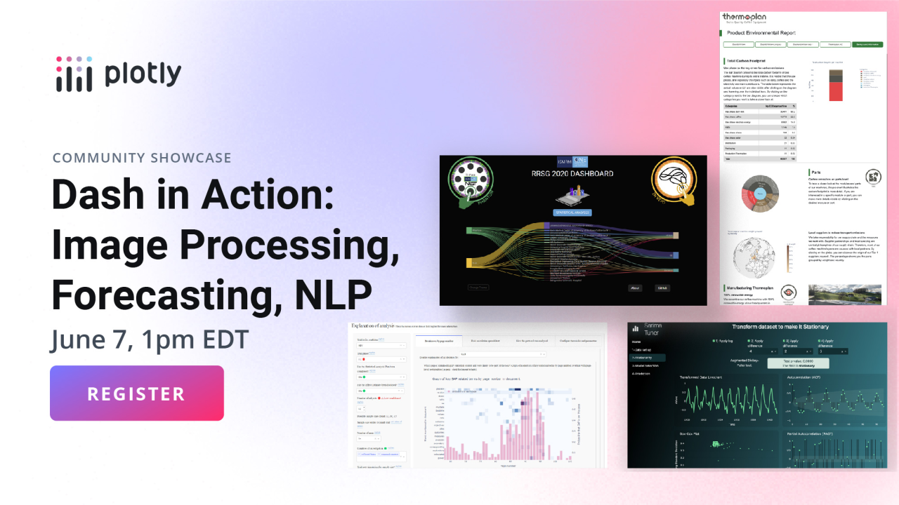
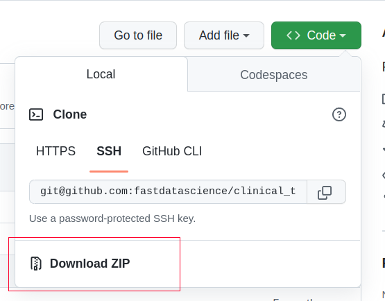
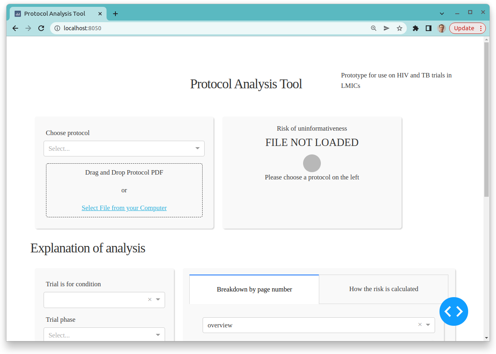
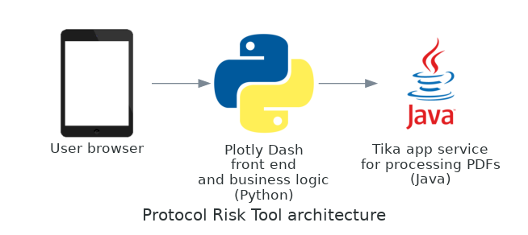
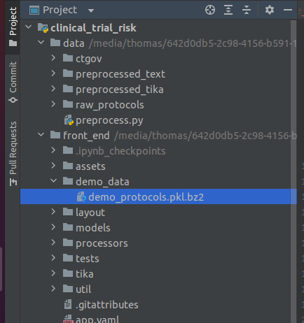
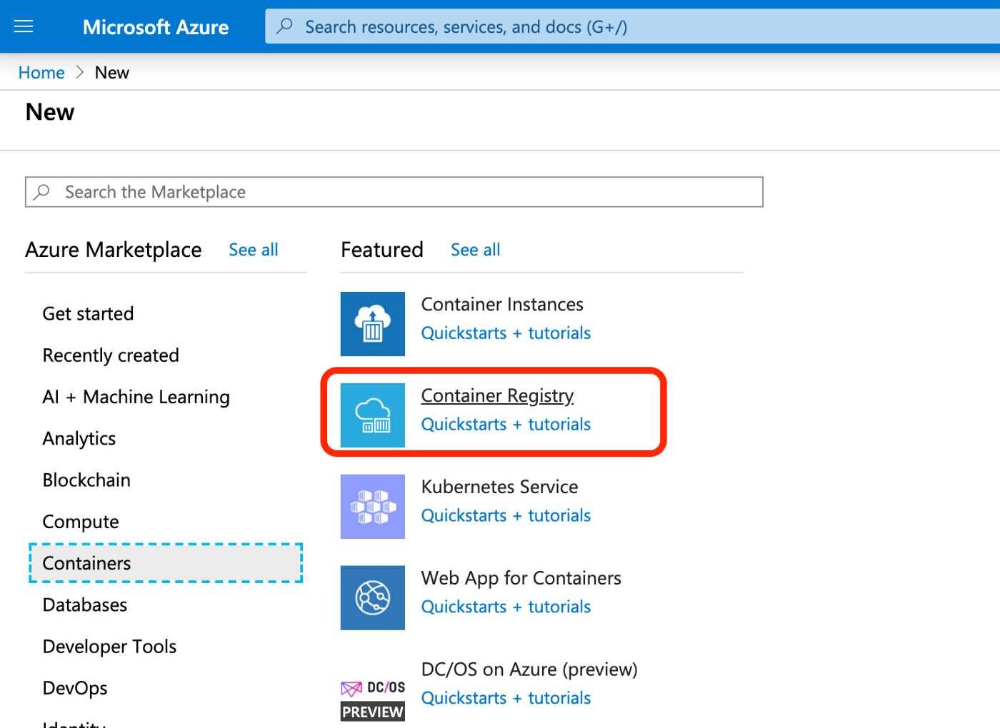
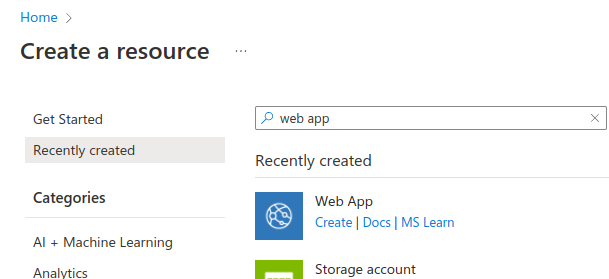
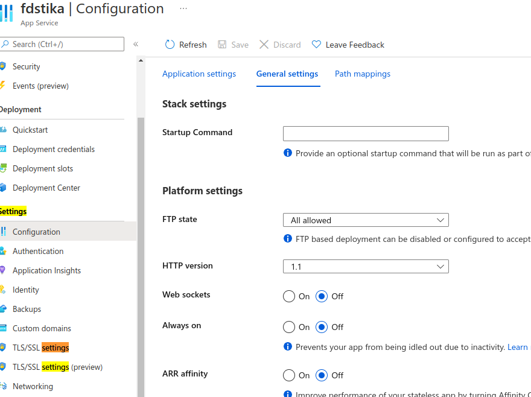
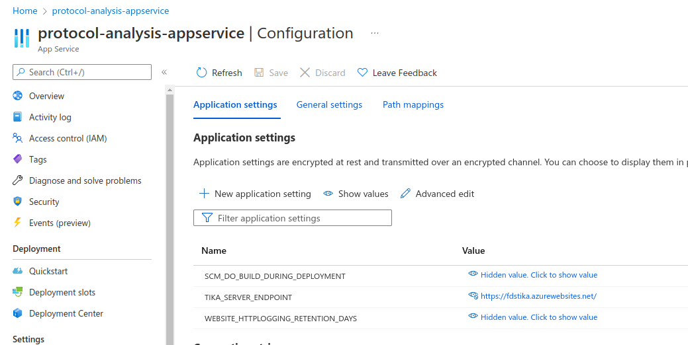

<a href="https://fastdatascience.com"><span align="left">🌐 fastdatascience.com</span></a>
<a href="https://www.linkedin.com/company/fastdatascience/"></a>
<a href="https://twitter.com/fastdatascienc1"></a>
<a href="https://www.instagram.com/fastdatascience/"></a>
<a href="https://www.facebook.com/fastdatascienceltd"></a>
<a href="https://www.youtube.com/channel/UCLPrDH7SoRT55F6i50xMg5g"></a>
<a href="https://g.page/fast-data-science"></a>
<a href="https://medium.com/fast-data-science"></a>
<a href="https://mastodon.social/@fastdatascience"></a>

# Protocol Analysis Tool for Clinical Trial Risk

## Update: Dash in Action webinar on 7 June 2023



Thomas Wood of [Fast Data Science](http://fastdatascience.com/) presented this tool at the [Plotly](https://plotly.com/) [Dash in Action webinar](https://go.plotly.com/dash-in-action), showing how the app uses [Natural Language Processing](https://naturallanguageprocessing.com) to estimate the risk of a clinical trial failing.

[](https://youtu.be/KL8cytV1qRA?t=2111 "The Dash App webinar")

## Where everything is 

Live demo available at: https://app.clinicaltrialrisk.org/

Project website at: https://clinicaltrialrisk.org/

Based on the Dash Natural Gas demo: https://github.com/plotly/dash-sample-apps

Runs on Dash interactive Python framework developed by [Plotly](https://plot.ly/). 

[Developed by Thomas Wood](https://fastdatascience.com/clinical-trial-risk-tool/) / Fast Data Science, https://fastdatascience.com

This tool is written in Python using the Dash front end library and the Java library Tika for reading PDFs, and runs on Linux, Mac, and Windows, and can be deployed as a web app using Docker.

You can read a walkthrough of how the tool works [here](https://clinicaltrialrisk.org/how-the-clinical-trial-risk-tool-works/) and of how accurate it is [here](https://clinicaltrialrisk.org/accurate-clinical-trial-risk-tool/).

## Very quick guide to running the tool on your computer

1. Install [Git](https://git-scm.com/book/en/v2/Getting-Started-Installing-Git).

2. Install [Git LFS](https://git-lfs.github.com/). *This is important - if you just have regular Git installed then only part of the repository will not be cloned, as the large binary files are stored in Git LFS (Large File Storage).*

3. clone this repository with the following command:
```
git clone git@github.com:fastdatascience/clinical_trial_risk.git
```

Alternatively to the above, you can click the Download button in the top right if you are using Github in the browser, and download and unzip the code:



4. Install [Docker](https://docs.docker.com/get-docker/).
5. Install [Docker Compose](https://docs.docker.com/compose/gettingstarted/).
6. Open a command line or Terminal window. Change folder to where you downloaded and unzipped the repository, and go to the folder `front_end`.  Run the following command:
```
docker-compose up
```
7. Open your browser at `https://localhost:80`


## Developer's guide: Running the tool on your computer in Python and without using Docker

### Architecture



### Installing requirements

Download and install Java if you don't have it already. Download and install Apache Tika and run it on your computer https://tika.apache.org/download.html

```
java -jar tika-server-standard-2.3.0.jar
```

(the version number of your Jar file name may differ.)

Install everything in `requirements.txt`:

```
pip install -r requirements.txt
```

Download the NLTK dependencies:

```
python -c 'import nltk; nltk.download("stopwords")'
```


### Running the front end app locally

There is more information in [front_end/README.md](front_end/README.md).

Go into `front_end` and run

```
python application.py
```

You can then open your browser at `localhost:8050` and you will see the tool.

### Working with the training data and re-training the machine learning models

There is more information on obtaining the training data in [data/README.md](train/README.md). Most data could not be supplied directly in this repository due to copyright and licensing restrictions.

If you don't have the training data, go into `data/raw_protocols` folder and run

```
./download_protocols.sh
```

This will download a subset of the raw PDF training data from the internet.

Next, run the following command to preprocess the data:

```
python preprocess.py
```

This will populate the `data/preprocessed_text` and `data/preprocessed_tika` folders with the preprocessed data.

### Adding demo protocols to the tool

If you want the tool to have some demo protocols in the dropdown, you can run `data/ctgov/09_MakePickleFile.ipynb` to generate a Pickle file which you can place in a folder "demo_data":



### Training the classifier model

There is more information on training in [train/README.md](train/README.md).

Go into the `train` folder and run

```
python train_condition_classifier.py
python train_effect_estimate_classifier.py
python train_num_subjects_classifier.py
python train_sap_classifier.py
python train_simulation_classifier.py
python train_word_cloud.py
```

Alternatively on Linux/Unix you can run a shell script to train all models:

```
for f in `ls train*py`; do python $f; done
```

This will write to the following files:

* `app/models/condition_classifier.pkl.bz2` - the three-way Naive Bayes classifier model that classifies protocols into HIV, TB or other.
* `app/models/effect_estimate_classifier.pkl.bz2` - the two-way Naive Bayes classifier model that classifies individual tokens of a protocol into effect estimate or not effect estimate.
* `app/models/num_subjects_classifier.pkl.bz2` - the Random Forest regressor model to identify sample sizes.
* `app/models/sap_classifier.pkl.bz2` - the two-way Naive Bayes classifier model that classifies individual pages of a protocol into SAP or not SAP.
* `app/models/simulation_classifier.pkl.bz2` - the two-way Naive Bayes classifier model that classifies individual pages of a protocol into simulation or not simulation.
* `app/models/idfs_for_word_cloud.pkl.bz2` - the Inverse Document Frequencies of words in the training dataset, used to select words for the word cloud.

# Working with data from ClinicalTrials.gov

There are some extra models which were trained from data downloaded from the ClinicalTrials.gov data dump.

This is in *data/ctgov*.

You will need to go to that folder and follow the instructions for downloading the Postgres data dump, and then run the shell scripts and Jupyter notebooks to generate the dataset.

You will need to run the Jupyter notebooks in the `train` folder to train these extra models.

There is more information on training from the ClinicalTrials.gov dataset in [train/ctgov/README.md](train/ctgov/README.md).

## Developer's guide: Deploying the tool as a web app to Microsoft Azure App Service

The Azure deployment consists of two separate web apps: a front end, and a Tika web app for PDF parsing.

### Creating a Tika Web App

The app depends on Tika as its PDF extraction library, which is written in Java. If you are running on the web instead of your computer, you need a remote Tika instance.

I deployed a Tika Docker instance on Azure Webapp.

This is from DockerHub, ID `apache/tika:2.3.0`.

So I went into Azure, selected New Webapp, and followed the options to create one from DockerHub.

Documentation is at https://github.com/apache/tika-docker

Now go into the Azure web portal at `portal.azure.com` and find the web app you created.

Also go into Settings -> Configuration -> Application settings and create an environment variable `PORT` and set it to `9998`. 

Finally, make sure to go into the Settings -> Configuration -> General settings and turn off "Always On"!

Note the URL of your Tika instance, e.g. `https://protocols-tika-webapp2.azurewebsites.net`.

### Deploying the Front End app as a Docker container to Microsoft Azure App Service via Azure Container Registry

Create a container registry in Microsoft Azure:



You need to enable the admin user in the Azure portal. Navigate to your registry, select Access keys under SETTINGS, then Enable under Admin user.

See here for more details: https://docs.microsoft.com/en-us/azure/container-registry/container-registry-authentication?tabs=azure-cli#admin-account

In command line, if you have installed Azure CLI, log into both the Azure Portal and Azure Container Registry:

```
az login
az acr login --name regprotocolsfds
```

If the admin user is not yet enabled, you can use the command:
```
az acr update -n regprotocolsfds --admin-enabled true
```

You can use Docker to deploy the front end app. In folder `front_end`, run command:

```
docker build -t protocols-front --build-arg COMMIT_ID=`git log | head -1 | awk '{print $2}'` .
```

(You can also run `./build_deploy.sh` as a shortcut)

To test the front end, you can run (with the appropriate value for your Tika endpoint URL):

```
docker run -p 80:80 -e TIKA_SERVER_ENDPOINT=https://protocols-tika-webapp2.azurewebsites.net protocols-front
```

Now to deploy it, you can run:

```
docker tag protocols-front regprotocolsfds.azurecr.io/protocols-front
docker push regprotocolsfds.azurecr.io/protocols-front
```


Now go into the Azure portal and create a web app:



Choose the Docker options and select Azure Container Registry, and select protocols-front as the container.

Make sure to go into the Settings -> Configuration in Azure and turn off "Always On"!



Now tell the front end app where to find the Tika app. You can do this either by command line or in the web portal. To use command line, do:

```
az webapp config appsettings set -g protocol -n protocols-webapp --settings TIKA_SERVER_ENDPOINT=https://protocols-tika-webapp2.azurewebsites.net
```

Alternatively, find the web app in the Azure web portal and go into Configuration and set environment variable in the Azure Dash web app to point to your Tika instance, e.g.

```
TIKA_SERVER_ENDPOINT=[URL of your Tika instance]
```

It's also a good idea to turn on continuous deployment, then you can redeploy the app from the command line by pushing to the Docker Container Registry.



Also for the front end web app, make sure to go into the Settings -> Configuration in Azure and turn off "Always On"!

## Alternative deployment (which hasn't worked as well): Deploying both Docker Containers via Docker Compose to Microsoft Azure App Service via Azure Container Registry

Create a container registry in Microsoft Azure with a name according to your choice, for example `regprotocolsfds`.

If your Azure container registry is named `regprotocolsfds` then its address will be `regprotocolsfds.azurecr.io`.

Make sure that the address of the container registry is in the `app/docker-compose.yml` file.


You need to enable the admin user in the Azure portal. Navigate to your registry, select Access keys under SETTINGS, then Enable under Admin user.

See here for more details: https://docs.microsoft.com/en-us/azure/container-registry/container-registry-authentication?tabs=azure-cli#admin-account

In command line, if you have installed Azure CLI, log into both the Azure Portal and Azure Container Registry:

```
az login
az acr login --name regprotocolsfds
```

If the admin user is not yet enabled, you can use the command:
```
az acr update -n regprotocolsfds --admin-enabled true
```

Build the Docker Compose containers:

```
docker-compose build
```

Push the Docker container to the Azure container registry:

```
docker-compose push
```


Choose the Docker options and select Container Type - Docker Compose and Registry Source - Azure Container Registry, and select protocols_prod as the container.

Set the Configuration File to `app/docker-compose.yml`.

Make sure to go into the Settings -> Configuration in Azure and turn off "Always On"!


You can configure the Azure web app so that every time you push a new container to the Azure container registry, the app is redeployed.

## Restricting access to the Tika webapp

You might want to set up an IP rule to make sure that only the front end app can access the Tika web app.

You can do this by going into the Tika webapp, and selecting Networking and Access Restrictions. You can add whitelist rules for the IP addresses of the front end app.

# Authentication

The tool's online version has user authentication. This feature is optional and becomes enabled if you set environment variables to the appropriate values:

```
export FLASK_SECRET_KEY="clinicaltrialsecret101"
export AUTH0_AUTH_URL="https://dev-jzg0b3h10nmydczi.us.auth0.com/authorize"
export AUTH0_AUTH_SCOPE="openid profile email"
export AUTH0_AUTH_TOKEN_URI="https://dev-jzg0b3h10nmydczi.us.auth0.com/oauth/token"
export AUTH0_AUTH_USER_INFO_URL="https://dev-jzg0b3h10nmydczi.us.auth0.com/userinfo"
export AUTH0_AUTH_CLIENT_ID="7lHpbJwWnGR1Z40912jS8BfJ8iobmDQo"
export AUTH0_AUTH_CLIENT_SECRET="[REDACTED]"
export AUTH0_LOGOUT_URL="https://dev-jzg0b3h10nmydczi.us.auth0.com/v2/logout"
export AUTH0_API_AUDIENCE="https://dev-jzg0b3h10nmydczi.us.auth0.com/api/v2/"
export AUTH_FLASK_ROUTES="true"
export DOWNLOAD_DIRECTORY=/tmp/downloads
```

You can get the correct values for Auth0 by creating a free account and project at https://auth0.com/.

If you do not set the values of the environment variables, the tool will run with no authentication.

# Storage

Optionally, if you want to allow users to save/load configurations, you will need to deploy with Azure Blob Storage or a similar storage solution where configurations can be saved.

In Microsoft Azure App Server, you can connect an instance of Azure File Storage to the app service so it is surfaced as a path on the filesystem. You then need to set environment variable `DOWNLOAD_DIRECTORY` to point to the appropriate location. Then user data can be persisted across sessions (e.g. when the server restarts).

## Built With

- [Dash](https://dash.plot.ly/) - Main server and interactive components
- [Plotly Python](https://plot.ly/python/) - Used to create the interactive plots
- [Docker](https://docs.docker.com/) - Used for deployment to the web
- [Apache Tika](https://tika.apache.org/) - Used for parsing PDFs to text
- [spaCy](https://spacy.io/) - Used for NLP analysis
- [NLTK](https://www.nltk.org/) - Used for NLP analysis
- [Scikit-Learn](https://scikit-learn.org/) - Used for machine learning
- [Auth0](https://auth0.com/) - Optional component for user authentication/login management

## Licences of Third Party Software

- Apache Tika: [Apache 2.0 License](https://tika.apache.org/license.html)
- spaCy: [MIT License](https://github.com/explosion/spaCy/blob/master/LICENSE)
- NLTK: [Apache 2.0 License](https://github.com/nltk/nltk/blob/develop/LICENSE.txt)
- Scikit-Learn: [BSD 3-Clause](https://github.com/scikit-learn/scikit-learn/blob/main/COPYING)

## References

* Deploying a Dash webapp via Docker to Azure: https://medium.com/swlh/deploy-a-dash-application-in-azure-using-docker-ed46c4b9d2b2

## How to cite the Clinical Trial Risk Tool?

If you would like to cite the tool alone, you can cite:

Wood TA and McNair D. [Clinical Trial Risk Tool](https://fastdatascience.com/clinical-trial-risk-tool/): software application using natural language processing to identify the risk of trial uninformativeness. Gates Open Res 2023, 7:56 doi: [10.12688/gatesopenres.14416.1](https://gatesopenresearch.org/articles/7-56).

A BibTeX entry for LaTeX users is

```
@article{Wood_2023,
	doi = {10.12688/gatesopenres.14416.1},
	url = {https://doi.org/10.12688%2Fgatesopenres.14416.1},
	year = 2023,
	month = {apr},
	publisher = {F1000 Research Ltd},
	volume = {7},
	pages = {56},
	author = {Thomas A Wood and Douglas McNair},
	title = {Clinical Trial Risk Tool: software application using natural language processing to identify the risk of trial uninformativeness},
	journal = {Gates Open Research}
}
```
